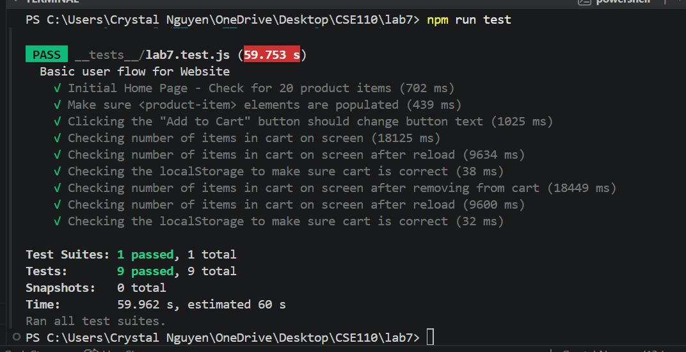

# Lab 7
Name: Crystal Nguyen 

## Check your understanding

1. Within a GitHub Action that runs whenever code is pushed, since it would allow me to detect bugs at an earlier stage and prevent new code from breaking existing functionality.
   
2. No, I wouldn't use an end to end test to check if a function is returning the correct output.
   
3. Navigation mode analyzes a webpage overall performance and its loading behavior. Snapshot mode analyzes the webpage's current state and checks for accesbility of the page rather than its performance while loading. 
   
4. Three things I would do to improve the CSE 110 shop based on the Lighthouse result are improving cache lifetime. minimizing render-blocking requests, and include a lang attribute to the HTML element. 

## passing the Tests Screenshots

